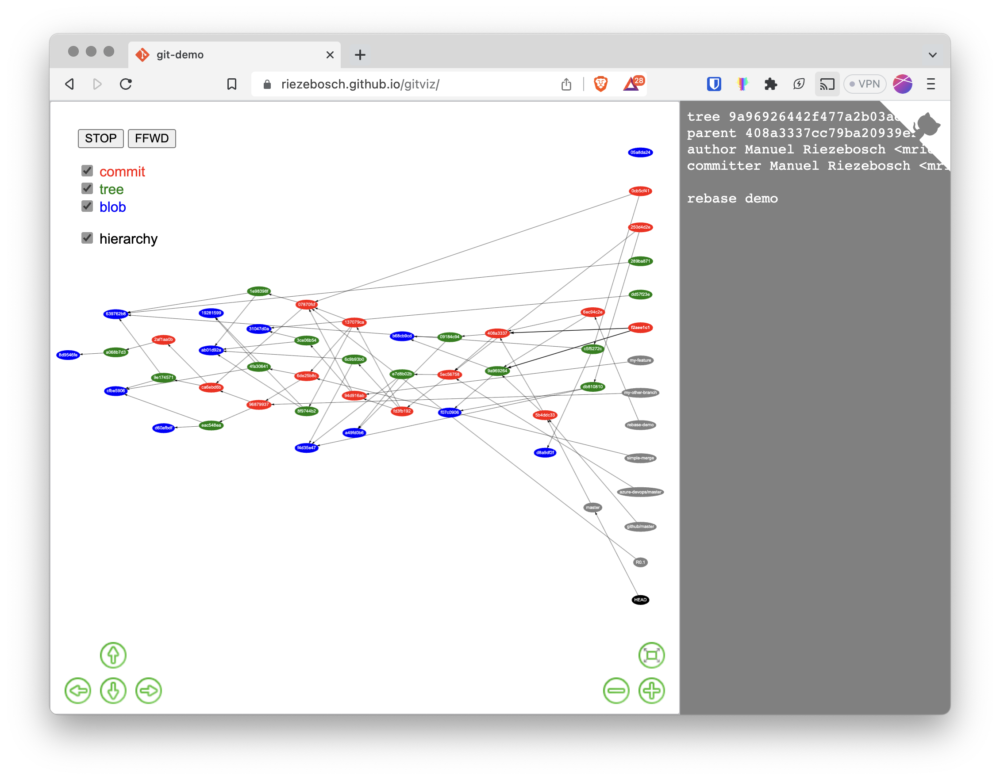

## gitviz

For education purposes: visualize the git repository real time revealing the blobs, trees and commits that make up
the [git data structure](https://eagain.net/articles/git-for-computer-scientists/).

color | type
------|-------
red   | commit
green | tree
blue  | blob
grey  | ref (branch, tag or HEAD)

Download from [releases](../../releases) and start from the root of your repo.